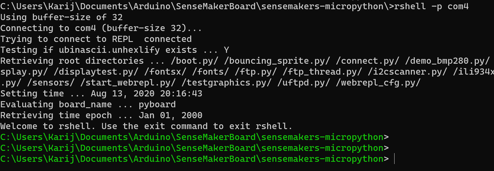
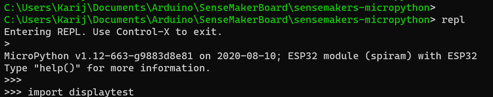

# Download and install MicroPython

Download the latest version of micropython for the esp32 from https://micropython.org/download/esp32/

Look for Firmware built with ESP-IDF v3.x, with support for BLE, LAN and PPP and SPIRam
At the time of writing we use:
“esp32spiram-idf3-20191220-v1.12.bin”

I use com port com7 in this document

esptool.py --chip esp32 --port com7 erase_flash

esptool.py --chip esp32 --port com7 --baud 460800 write_flash -z 0x1000 esp32spiram-idf3-20191220-v1.12.bin

# Download the workshop files to your computer

For this tutorials, I used modified files from the github page …
Download all files from this repository to your computer.
According to your needs, upload the images folder to the esp32’s images folder and the fonts to the fonts folder.

- Upload the python files to the root of the ttgo board
- Upload the ‘images’ folder to the ‘images’ folder of the ttgo
- Upload the ‘fonts’ folder to the ‘fonts’ folder of the ttgo
note that not all files can be stored to the ttgo at the same time, just copy the files needed for a specific project.

# Download and install the base files and folders

In the rest of this workshop, we assume that you are using rshell as the user interface to your ttg0 board and that you have a connection open.

To start rshell with the correct comport (in my case com4) and apply the following command:

> rshell -p com4

You see the rshell prompt in graan after starting rshell.

using the rshell prompt create 3 directories 
> mkdir /pyboard/fonts
> mkdir /pyboard/images
> mkdir /pyboard/sensors

... and copy the display files to the ttgo

> cp ili934xnew.py /pyboard
> cp display.py /pyboard

# Start the fun

To test if everything is working, install the following fonts to the fonts folder on your ttgo board:

in rshell, you can do this with the following command:

> cp fonts/glcdfont.py /pyboard/fonts/
> cp fonts/tt14.py /pyboard/fonts/
> cp fonts/tt24.py /pyboard/fonts/
> cp fonts/tt32.py /pyboard/fonts/

and finaly, copy displaytest.py to the ttg0

> cp displaytest.py /pyboard/

start the micropython prompt

> repl

and import displaytest.py

now the ttgo's display shoud show "Now is the time for all Sensemakers to come to the aid of the party." in different fonts and colors.
